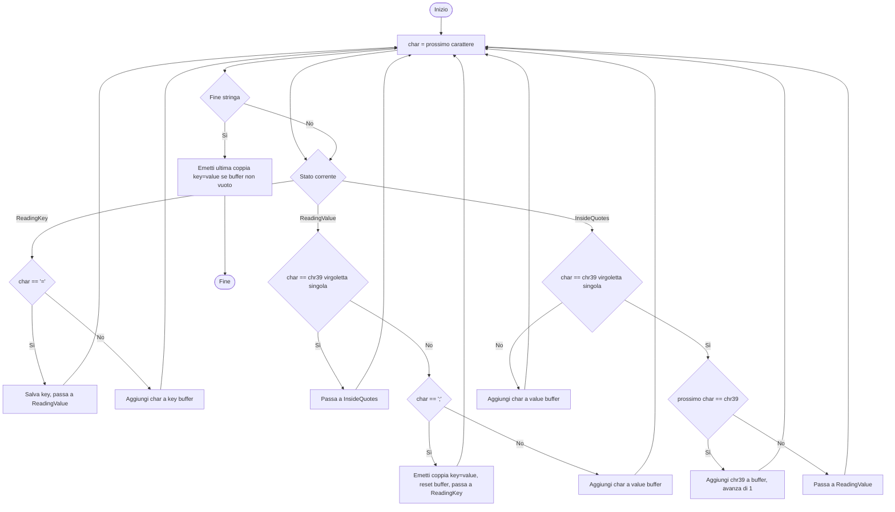
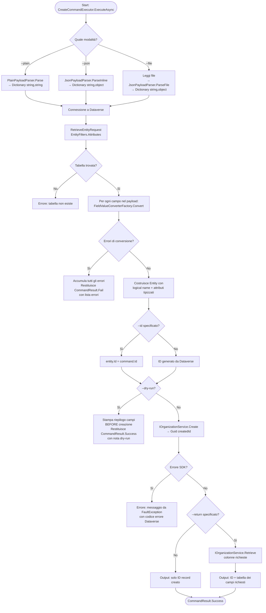
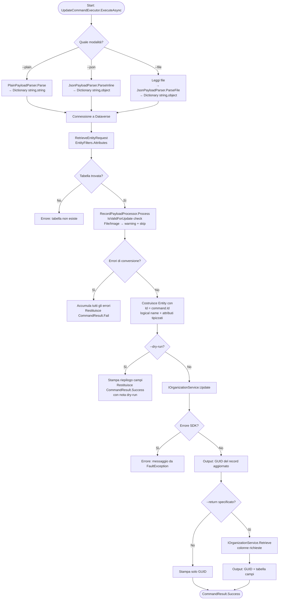

# Piano di implementazione: `pacx data create`

## Indice

1. [Panoramica](#panoramica)
2. [Struttura dei file](#struttura-dei-file)
3. [Firma del comando](#firma-del-comando)
4. [Modalità di input](#modalità-di-input)
5. [Tabella dei tipi supportati](#tabella-dei-tipi-supportati)
6. [Logica del parser `--plain`](#logica-del-parser---plain)
7. [Logica del parser `--json` / `--file`](#logica-del-parser---json--file)
8. [Risoluzione delle lookup](#risoluzione-delle-lookup)
9. [Conversione dei valori per tipo](#conversione-dei-valori-per-tipo)
10. [Flusso di esecuzione principale](#flusso-di-esecuzione-principale)
11. [Output del comando](#output-del-comando)
12. [Gestione degli errori](#gestione-degli-errori)
13. [ICanProvideUsageExample](#icanprovideusageexample)

---

## Panoramica

Il comando `pacx data create` consente di creare un record su una tabella Dataverse specificando i valori dei campi tramite due modalità alternative:

- **`--plain`**: stringa compatta con coppie `campo=valore` separate da `;`, ideale per l'uso da console
- **`--json`** / **`--file`**: payload JSON, ideale per pipeline e agenti IA

Il comando è progettato per:
- Supportare i tipi di campo Dataverse elencati nella tabella seguente; i campi File/Image vengono ignorati con un warning e i tipi non supportati producono un errore
- Essere **utilizzabile da agenti IA** senza conoscere la sintassi del form maker
- Risolvere le **lookup per valore di campo** (non solo per GUID), interrogando Dataverse al momento dell'esecuzione
- Operare in modalità **dry-run** per validare il payload senza creare il record

---

## Struttura dei file

```
Greg.Xrm.Command.Core\
  Commands\
    Data\
      Create\
        CreateCommand.cs
        CreateCommandExecutor.cs
      Update\
        UpdateCommand.cs
        UpdateCommandExecutor.cs
      RecordPayload\
        Parsing\
          PlainPayloadParser.cs
          JsonPayloadParser.cs
          LookupReferenceParser.cs
        ValueConverters\
          IFieldValueConverter.cs
          FieldValueConverterFactory.cs
          StringFieldValueConverter.cs
          NumberFieldValueConverter.cs
          BooleanFieldValueConverter.cs
          DateTimeFieldValueConverter.cs
          ChoiceFieldValueConverter.cs
          MultiSelectChoiceFieldValueConverter.cs
          LookupFieldValueConverter.cs
        RecordPayloadProcessor.cs
```

`RecordPayloadProcessor` è il servizio condiviso tra `data create` e `data update` che racchiude tutta la logica di parsing, conversione e risoluzione lookup.

---

## Firma del comando

```csharp
[Command("data", "create", HelpText = "Creates a record in a Dataverse table.")]
public class CreateCommand : IValidatableObject, ICanProvideUsageExample
{
    [Option("table", "t", HelpText = "Logical name of the target table.")]
    [Required]
    public string? Table { get; set; }

    [Option("plain", "p", HelpText = "Semicolon-separated list of field=value pairs. Mutually exclusive with --json and --file.")]
    public string? Plain { get; set; }

    [Option("json", "j", HelpText = "JSON string representing the record payload. Mutually exclusive with --plain and --file.")]
    public string? Json { get; set; }

    [Option("file", "f", HelpText = "Path to a JSON file containing the record payload. Mutually exclusive with --plain and --json.")]
    public string? File { get; set; }

    [Option("id", HelpText = "Optional GUID to assign to the new record.")]
    public Guid? Id { get; set; }

    [Option("return", "r", HelpText = "Comma-separated list of columns to return after creation. If omitted, only the record ID is returned.")]
    public string? Return { get; set; }

    [Option("dry-run", "dr", HelpText = "Validates the payload without creating the record.", DefaultValue = false)]
    public bool DryRun { get; set; }

    public IEnumerable<ValidationResult> Validate(ValidationContext validationContext)
    {
        var provided = new[] { Plain, Json, File }.Count(x => !string.IsNullOrWhiteSpace(x));
        if (provided == 0)
            yield return new ValidationResult("One of --plain, --json, or --file must be provided.", [nameof(Plain), nameof(Json), nameof(File)]);
        if (provided > 1)
            yield return new ValidationResult("Only one of --plain, --json, or --file can be provided at a time.", [nameof(Plain), nameof(Json), nameof(File)]);
        if (!string.IsNullOrWhiteSpace(File) && !System.IO.File.Exists(File))
            yield return new ValidationResult($"The file '{File}' does not exist.", [nameof(File)]);
    }
}
```

---

## Modalità di input

### `--plain`

Stringa singola con coppie `campo=valore` separate da `;`.  
Le virgolette singole delimitano i valori che contengono caratteri speciali (`;`, `=`, `)`).  
La sequenza `''` dentro le virgolette rappresenta una virgoletta letterale.

```powershell
pacx data create -t contact --plain "firstname=Mario;lastname=Rossi;ownerid=systemuser(domainname='mario.rossi@contoso.com')"
```

### `--json`

JSON inline come stringa singola.

```powershell
pacx data create -t contact --json '{"firstname":"Mario","lastname":"Rossi","ownerid":"systemuser(domainname=''mario.rossi@contoso.com'')"}'
```

### `--file`

Percorso a un file `.json` contenente il payload.

```powershell
pacx data create -t contact --file ./contact.json
```

---

## Tabella dei tipi supportati

| Tipo Dataverse | Esempio `--plain` | Esempio `--json` | Note |
|---|---|---|---|
| String / Memo | `name=Acme Corp` | `"name": "Acme Corp"` | |
| Integer | `numberofemployees=500` | `"numberofemployees": 500` | |
| Decimal | `exchangerate=1.25` | `"exchangerate": 1.25` | |
| Double | `latitude=45.4654` | `"latitude": 45.4654` | |
| Money | `revenue=1000000` | `"revenue": 1000000` | Valuta base dell'organizzazione |
| Boolean | `donotcontact=true` | `"donotcontact": true` | |
| DateTime | `closedon=2025-01-15T10:30:00Z` | `"closedon": "2025-01-15T10:30:00Z"` | ISO 8601 |
| DateOnly | `birthdate=1990-05-20` | `"birthdate": "1990-05-20"` | Solo parte data |
| Choice (per valore) | `statecode=1` | `"statecode": 1` | |
| Choice (per label) | `statecode=Active` | `"statecode": "Active"` | Case-insensitive |
| Multi-Select (per valore) | `new_tags=1,2,3` | `"new_tags": [1, 2, 3]` | |
| Multi-Select (per label) | `new_tags=Red,Blue` | `"new_tags": ["Red", "Blue"]` | Case-insensitive |
| Lookup (per GUID) | `ownerid=systemuser(guid)` | `"ownerid": "systemuser(guid)"` | |
| Lookup (per campo) | `ownerid=systemuser(email='x@y.com')` | `"ownerid": "systemuser(email='x@y.com')"` | |
| Null / svuota | `description=` (vuoto) | `"description": null` | |
| **File / Image** | — | — | **Warning + skip** (vedi sotto) |

---

## Logica del parser `--plain`

### Problema

Un semplice `string.Split(';')` non è sufficiente perché il `;` può comparire come carattere letterale all'interno di valori quoted. Stessa cosa per `=` nei valori di lookup.

### Tokenizer stateful

Il parser scorre la stringa carattere per carattere mantenendo un contesto:

```
STATI:
  ReadingKey       → accumula caratteri del nome campo
  ReadingValue     → accumula caratteri del valore
  InsideQuotes     → dentro una stringa quoted (single-quote aperta)

REGOLE DI TRANSIZIONE:
  ReadingKey  + '='  → passa a ReadingValue (split key/value sul primo '=')
  ReadingValue + ';' → emette coppia (key, value), torna a ReadingKey
  ReadingValue + ';' se InsideQuotes → accumula carattere, non emette
  ReadingValue + '\'' → entra in InsideQuotes
  InsideQuotes + '\'' seguito da '\'' → emette '\'' letterale, resta in InsideQuotes
  InsideQuotes + '\'' (non seguito da '\'') → esce da InsideQuotes
  Fine stringa → emette l'ultima coppia (key, value)
```

### Diagramma di flusso del tokenizer



### Output del parser

`Dictionary<string, string>` dove ogni entry è una coppia `logicalname → raw string value`.

---

## Logica del parser `--json` / `--file`

### Input

- `--json`: stringa JSON inline
- `--file`: contenuto del file letto in modo sincrono con `File.ReadAllText`

### Parsing

Il JSON viene deserializzato come `JsonDocument` (o `JObject`). Ogni proprietà viene letta come:

- `JsonValueKind.String` → `string`
- `JsonValueKind.Number` → `long` o `double` a seconda del formato
- `JsonValueKind.True` / `False` → `bool`
- `JsonValueKind.Null` → `null`
- `JsonValueKind.Array` → `List<object?>` (usato per multi-select choice)
- `JsonValueKind.Object` → non supportato, errore esplicito

L'output è un `Dictionary<string, object?>` con valori grezzi non ancora tipizzati per Dataverse.

> Il tipo definitivo viene determinato in fase di conversione, dopo aver letto i metadati della tabella.

---

## Risoluzione delle lookup

### Sintassi

```
entità(GUID)                        → EntityReference diretto
entità(nomecampo='valore')          → query OData per risolvere il GUID
```

### Parser della riferimento lookup

Regex di riconoscimento del pattern:

```
^([a-z][a-z0-9_]*)\((.+)\)$
```

Gruppo 1 → nome logico della tabella di destinazione  
Gruppo 2 → contenuto interno: GUID oppure `nomecampo='valore'`

**Caso GUID:**

```
contenuto interno = "3fa85f64-5717-4562-b3fc-2c963f66afa6"
→ Guid.TryParse → successo
→ new EntityReference(entityLogicalName, guid)
```

**Caso field-based:**

```
contenuto interno = "domainname='mario.rossi@contoso.com'"
→ regex: ^([a-z][a-z0-9_]+)='(.+)'$  (con gestione delle '' escape)
→ fieldName = "domainname"
→ fieldValue = "mario.rossi@contoso.com"
→ RetrieveEntityRequest { LogicalName = "systemuser", EntityFilters = EntityFilters.Entity }
  → PrimaryIdAttribute = "systemuserid"
→ QueryExpression("systemuser") { ColumnSet = ["systemuserid"], TopCount = 2 }
  con Criteria: domainname = 'mario.rossi@contoso.com'
→ RetrieveMultipleAsync(query)
```

### Diagramma di flusso — Risoluzione lookup

```mermaid
flowchart TD
    A([Inizio: raw value = 'entità param']) --> B[Applica regex pattern]
    B --> C{Match trovato?}
    C -->|No| D[Errore: formato lookup non riconosciuto]
    C -->|Sì| E[entityName = gruppo 1\ncontentInner = gruppo 2]
    E --> F{Guid.TryParse\ncontentInner}
    F -->|Sì| G[Restituisce EntityReference\nentityName + GUID]
    F -->|No| H[Applica regex\nnomecampo='valore']
    H --> I{Match trovato?}
    I -->|No| J[Errore: sintassi field-based non valida]
    I -->|Sì| K[fieldName, fieldValue estratti\n'' unescaped a ']
    K --> L[RetrieveEntityRequest\nEntityFilters.Entity\n→ PrimaryIdAttribute]
    L --> M[QueryExpression con ColumnSet={pk}\nCriteria: fieldName = fieldValue\nTopCount = 2\nRetrieveMultipleAsync]
    M --> N{Risultati}
    N -->|0 record| O[Errore: nessun record trovato]
    N -->|2+ record| P[Errore: valore ambiguo, più record corrispondono]
    N -->|1 record| Q[Restituisce EntityReference\nentityName + GUID risolto]
```

> **Gestione `''` nei valori field-based**: il valore viene unescaped sostituendo `''` con `'` prima di essere passato come parametro a `QueryExpression`. La query viene eseguita tramite `RetrieveMultipleAsync`, non tramite OData.

---

## Conversione dei valori per tipo

### Principio

Il comando recupera i metadati della tabella target con `RetrieveEntityRequest { EntityFilters = EntityFilters.Attributes }`. Per ogni campo nel payload, individua l'`AttributeMetadata` corrispondente e delega la conversione al converter appropriato.

### Diagramma di flusso — Conversione campo

```mermaid
flowchart TD
    A([Campo: nome + raw value]) --> B[Cerca AttributeMetadata\nper logical name]
    B --> C{Trovato?}
    C -->|No| D[Errore: campo non esiste sulla tabella]
    C -->|Sì| E{Tipo == FileAttribute\no ImageAttribute?}
    E -->|Sì| W[⚠️ Warning non bloccante:\n'Field x is of type File/Image\nand will be skipped.'\nCampo escluso dal payload]
    E -->|No| F{raw value è null\no stringa vuota?}
    F -->|Sì| G[Imposta campo = null\ncancella valore esistente]
    F -->|No| H{Tipo AttributeMetadata}

    H -->|StringAttribute\nMemoAttribute| I[Restituisce string]
    H -->|IntegerAttribute| J[int.Parse → int]
    H -->|DecimalAttribute| K[decimal.Parse → decimal]
    H -->|DoubleAttribute| L[double.Parse → double]
    H -->|MoneyAttribute| M[decimal.Parse → new Money]
    H -->|BooleanAttribute| N[bool.Parse → bool]
    H -->|DateTimeAttribute| O{DateTimeBehavior\n== DateOnly?}
    O -->|Sì| P[DateOnly.Parse → DateTime\n(parte data, ora 00:00:00)]
    O -->|No| Q[DateTime.Parse ISO 8601 → DateTime]
    H -->|PicklistAttribute\nStateAttribute\nStatusAttribute| R{raw è intero?}
    R -->|Sì| S[new OptionSetValue(int)]
    R -->|No| T[Cerca label in OptionMetadata\n→ new OptionSetValue(matchingValue)]
    H -->|MultiSelectPicklistAttribute| U[Split su virgola,\nconverti ogni token come Choice\n→ new OptionSetValueCollection]
    H -->|LookupAttribute\nCustomerAttribute\nOwnerAttribute| V[LookupReferenceParser\n→ EntityReference]

    I & J & K & L & M & N & P & Q & S & T & U & V --> Z([Valore SDK tipizzato])
```

---

## Flusso di esecuzione principale



---

## Output del comando

### Output standard (nessun `--return`)

Il comando segnala sempre la creazione riuscita e restituisce il GUID strutturato nel risultato finale del runner.

```
Creating record on table 'contact'... Done

Record created successfully.  Table: contact
Result:
  Id: 3fa85f64-5717-4562-b3fc-2c963f66afa6
```

### Output con `--return firstname,lastname,emailaddress1`

Se viene richiesto `--return`, l'output tabellare mostra anche l'`id` del record risolto oltre ai campi restituiti.

```
Creating record on table 'contact'... Done

Record created successfully.  Table: contact

  Field            Value
  ─────────────── ────────────────────────────
  id               3fa85f64-5717-4562-b3fc-2c963f66afa6
  firstname        Mario
  lastname         Rossi
  emailaddress1    mario.rossi@contoso.com

Result:
  Id: 3fa85f64-5717-4562-b3fc-2c963f66afa6
```

### Output con `--dry-run`

```
[DRY RUN] The following record would be created on table 'contact':

  Field            Parsed Value                            SDK Type
  ─────────────── ─────────────────────────────────────── ──────────────────
  firstname        Mario                                   String
  lastname         Rossi                                   String
  ownerid          systemuser / 00000000-...               EntityReference
  birthdate        1990-05-20 00:00:00                     DateTime (DateOnly)

No record was created.
```

---

## Gestione degli errori

Gli errori di **conversione per campo** vengono accumulati da `RecordPayloadProcessor` prima del fallimento. Gli errori di parsing del payload (`--plain`, `--json`, `--file`) invece interrompono subito l'esecuzione al primo input malformato.

| Scenario | Messaggio di errore |
|---|---|
| Campo di tipo File o Image | ⚠️ `Field 'new_photo' is of type Image and cannot be set via this command. The field will be skipped.` |
| Campo non trovato sulla tabella | `Field 'xyz' does not exist on table 'contact'.` |
| Tipo non compatibile | `Field 'birthdate' (DateOnly): value '15-01-2025' is not a valid date. Expected format: yyyy-MM-dd.` |
| Lookup — nessun record trovato | `Field 'ownerid': no systemuser found with domainname = 'x@y.com'.` |
| Lookup — valore ambiguo | `Field 'ownerid': 3 systemuser records match domainname = 'mario'. Use a more specific value or a GUID.` |
| Lookup — formato non valido | `Field 'parentaccountid': lookup reference 'foo bar' does not match expected format: entity(GUID) or entity(field='value').` |
| Choice — label non trovata | `Field 'statecode': label 'Pippo' not found. Valid values: Active (0), Inactive (1).` |
| Tabella non trovata | `Table 'contaxt' does not exist in the current environment. Did you mean 'contact'?` |
| JSON malformato | `Invalid JSON payload: Unexpected character at position 42.` |
| Errore SDK Dataverse | `Dataverse error [0x80040265]: ...messaggio originale...` |

---

## ICanProvideUsageExample

Il metodo `WriteUsageExamples` deve produrre una documentazione completa analoga a quella di `data query`. Struttura suggerita:

```
### Overview
Descrizione del comando e delle sue modalità.

### Input modes
Spiega --plain, --json, --file con regole di esclusività.

### Supported field types
Tabella di tutti i tipi con sintassi --plain e --json.

### Lookup references
Spiega la sintassi entity(GUID) e entity(field='value').
Spiega l'escape delle virgolette con ''.

### --plain escaping rules
Spiega il tokenizer: ';' come separatore, '' come escape,
il fatto che '(' e ')' non richiedono escape perché il parser è stateful.

### Options
Elenco di --id, --return, --dry-run con esempi.

### Examples (PowerShell)
Almeno 8-10 esempi pratici che coprono i casi principali.
```

### Esempi da includere nella sezione PowerShell

```powershell
# Creare un contatto con valori semplici
pacx data create -t contact --plain "firstname=Mario;lastname=Rossi"

# Creare un account con lookup al proprietario per domainname
pacx data create -t account --plain "name=Acme Corp;ownerid=systemuser(domainname='mario.rossi@contoso.com')"

# Specificare un GUID predeterminato per il record
pacx data create -t account --plain "name=Acme Corp" --id 3fa85f64-5717-4562-b3fc-2c963f66afa6

# Creare e restituire campi specifici
pacx data create -t contact --plain "firstname=Mario;lastname=Rossi" --return "firstname,lastname,fullname"

# Usare --json per payload complessi (utile per pipeline IA)
pacx data create -t opportunity --json '{"name":"Big Deal","estimatedvalue":50000,"statecode":0,"parentaccountid":"account(name=''Acme Corp'')"}'

# Creare da file JSON
pacx data create -t contact --file ./new-contact.json

# Dry-run: verifica il payload senza creare il record
pacx data create -t contact --plain "firstname=Mario;birthdate=1990-05-20;ownerid=systemuser(domainname='mario.rossi@contoso.com')" --dry-run

# Multi-select choice per valore intero
pacx data create -t new_survey --plain "new_tags=1,2,3"

# Multi-select choice per label
pacx data create -t new_survey --plain "new_tags=Red,Blue,Green"

# Lookup polimorfica (Customer): può puntare ad account o contact
pacx data create -t incident --plain "title=Support Case;customerid=account(accountnumber='ACME001')"

# Svuotare un campo nullable
pacx data create -t contact --plain "description="

# Valore con virgoletta singola nel nome (escape con '')
pacx data create -t account --plain "name=Riccardo''s Corp"
```

---

## Note implementative

### Recupero metadati

Il metadata fetch avviene **una sola volta** per esecuzione, prima del loop di conversione. Usare `RetrieveEntityRequest` con `EntityFilters.Attributes` e cachare il risultato localmente — non è necessaria una cache globale.

### Risoluzione del plural name per le query OData delle lookup

Usare `RetrieveEntityRequest` sulla tabella di destinazione della lookup per ottenere `EntityMetadata.EntitySetName` (il plural name OData). Non costruire il plural name manualmente (es. aggiungendo `s`) per evitare errori su tabelle con nomi irregolari.

### Ordine di validazione

1. Parsing sintattico del payload (`--plain` o `--json`)
2. Fetch metadati tabella
3. Conversione e validazione di tutti i campi (accumulando errori)
4. Risoluzione lookup (con query OData — solo se non ci sono errori di conversione precedenti)
5. Creazione record (solo se tutto OK)

### Campi di sola lettura

I campi con `AttributeMetadata.IsValidForCreate == false` devono essere ignorati con un warning (non un errore bloccante), per facilitare scenari dove il payload viene generato automaticamente da un'IA che ha recuperato un record esistente e vuole ricrearlo.

### Campi File e Image

I campi di tipo `FileAttributeMetadata` e `ImageAttributeMetadata` non possono essere impostati tramite l'SDK standard con una semplice `Entity.Create` o `Entity.Update` (richiedono chiamate separate alle API di upload). Se l'utente li include nel payload:

1. Viene emesso un **warning non bloccante** su console (colore giallo)
2. Il campo viene **rimosso dal payload** prima della creazione/aggiornamento
3. L'esecuzione **prosegue normalmente** con i campi restanti

Il warning è visibile sia in modalità normale che in `--dry-run`.

### Namespace

```
Greg.Xrm.Command.Commands.Data
Greg.Xrm.Command.Commands.Data.Create
Greg.Xrm.Command.Commands.Data.Update
Greg.Xrm.Command.Commands.Data.RecordPayload.Parsing
Greg.Xrm.Command.Commands.Data.RecordPayload.ValueConverters
```

---

## Comando `data update`

### Panoramica

Il comando `pacx data update` aggiorna un record esistente su una tabella Dataverse. Condivide tutta la logica di parsing, conversione e risoluzione lookup con `data create` tramite il `RecordPayloadProcessor` condiviso. L'unica differenza strutturale è la presenza del parametro obbligatorio `--id` che identifica il record da aggiornare.

### Firma del comando

```csharp
[Command("data", "update", HelpText = "Updates an existing record in a Dataverse table.")]
public class UpdateCommand : IValidatableObject, ICanProvideUsageExample
{
    [Option("table", "t", HelpText = "Logical name of the target table.")]
    [Required]
    public string? Table { get; set; }

    [Option("id", "id", HelpText = "GUID of the record to update.")]
    [Required]
    public Guid Id { get; set; }

    [Option("plain", "p", HelpText = "Semicolon-separated list of field=value pairs. Mutually exclusive with --json and --file.")]
    public string? Plain { get; set; }

    [Option("json", "j", HelpText = "JSON string representing the fields to update. Mutually exclusive with --plain and --file.")]
    public string? Json { get; set; }

    [Option("file", "f", HelpText = "Path to a JSON file containing the fields to update. Mutually exclusive with --plain and --json.")]
    public string? File { get; set; }

    [Option("return", "r", HelpText = "Comma-separated list of columns to return after the update. If omitted, only the record ID is returned.")]
    public string? Return { get; set; }

    [Option("dry-run", "dr", HelpText = "Validates the payload without updating the record.", DefaultValue = false)]
    public bool DryRun { get; set; }

    public IEnumerable<ValidationResult> Validate(ValidationContext validationContext)
    {
        var provided = new[] { Plain, Json, File }.Count(x => !string.IsNullOrWhiteSpace(x));
        if (provided == 0)
            yield return new ValidationResult("One of --plain, --json, or --file must be provided.", [nameof(Plain), nameof(Json), nameof(File)]);
        if (provided > 1)
            yield return new ValidationResult("Only one of --plain, --json, or --file can be provided at a time.", [nameof(Plain), nameof(Json), nameof(File)]);
        if (!string.IsNullOrWhiteSpace(File) && !System.IO.File.Exists(File))
            yield return new ValidationResult($"The file '{File}' does not exist.", [nameof(File)]);
    }
}
```

> **Nota**: `data update` non ha il parametro `--id` per assegnare un GUID predeterminato (presente in `data create`). In `data update`, `--id` identifica il record da aggiornare ed è sempre obbligatorio.

### Differenze rispetto a `data create`

| Aspetto | `data create` | `data update` |
|---|---|---|
| Parametro `--id` | Opzionale (assegna GUID al nuovo record) | **Obbligatorio** (identifica il record da aggiornare) |
| Operazione SDK | `IOrganizationService.Create()` | `IOrganizationService.Update()` |
| Campi read-only | `IsValidForCreate == false` → warning + skip | `IsValidForUpdate == false` → warning + skip |
| Output | GUID del record creato | GUID del record aggiornato |
| `--return` | Retrieve dopo Create | Retrieve dopo Update |

### Flusso di esecuzione `data update`



### Output di `data update`

```
Updating record on table 'contact' (3fa85f64-5717-4562-b3fc-2c963f66afa6)... Done

Record updated successfully.
  Table : contact
  Id    : 3fa85f64-5717-4562-b3fc-2c963f66afa6
```

### Esempi PowerShell per `data update`

```powershell
# Aggiornare il cognome di un contatto
pacx data update -t contact --id 3fa85f64-5717-4562-b3fc-2c963f66afa6 --plain "lastname=Bianchi"

# Aggiornare più campi con JSON
pacx data update -t account --id 3fa85f64-5717-4562-b3fc-2c963f66afa6 --json '{"name":"Acme Corp Srl","telephone1":"+39 02 1234567"}'

# Aggiornare e restituire i campi modificati
pacx data update -t contact --id 3fa85f64-5717-4562-b3fc-2c963f66afa6 --plain "statecode=1" --return "fullname,statecode"

# Aggiornare una lookup per campo
pacx data update -t contact --id 3fa85f64-5717-4562-b3fc-2c963f66afa6 --plain "ownerid=systemuser(domainname='nuovo.owner@contoso.com')"

# Dry-run prima di aggiornare
pacx data update -t contact --id 3fa85f64-5717-4562-b3fc-2c963f66afa6 --plain "birthdate=1985-03-22;jobtitle=Developer" --dry-run

# Aggiornare da file JSON
pacx data update -t contact --id 3fa85f64-5717-4562-b3fc-2c963f66afa6 --file ./updates.json

# Svuotare un campo
pacx data update -t contact --id 3fa85f64-5717-4562-b3fc-2c963f66afa6 --plain "description="
```
